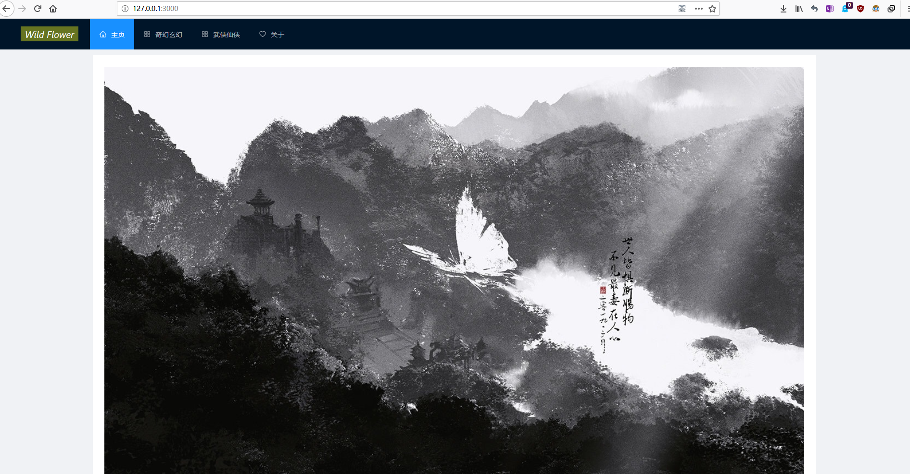
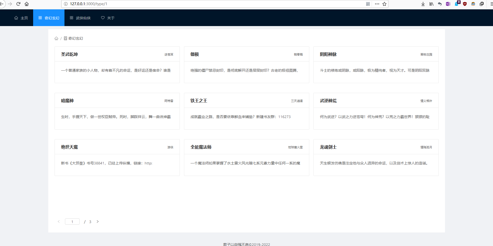
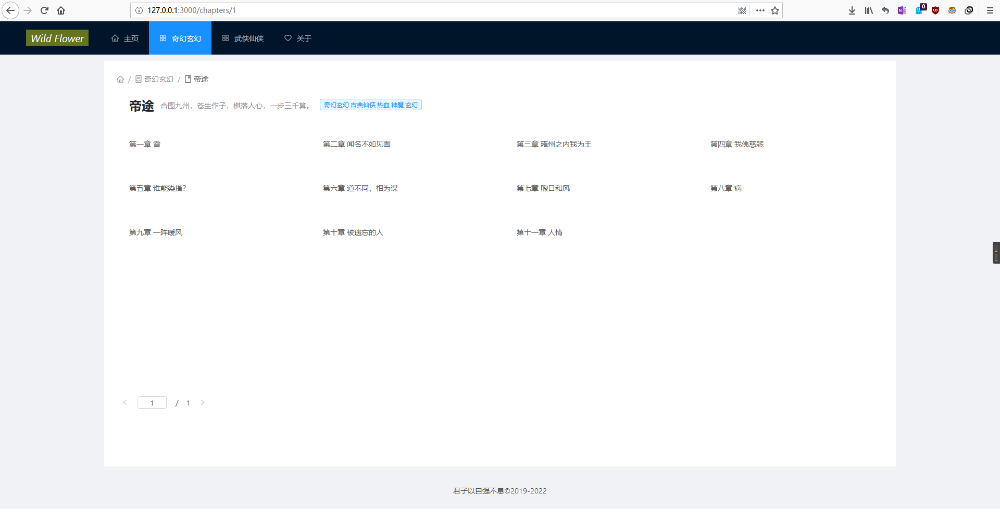
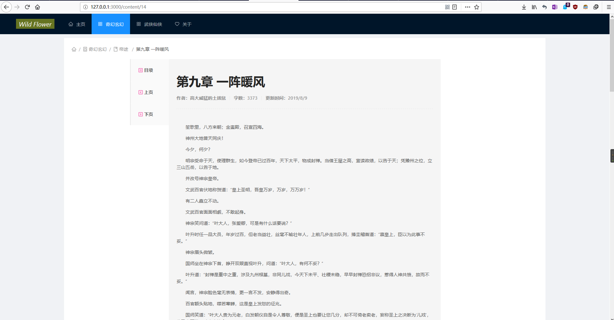

# 简介

***

该网站采用前后端分离 restful风格的架构，由scrapy爬取提供数据


## 前端部分

---

这个仓库即前端部分

react + antd design + mobx


```react
const App = () => (
  <Router>
    <Layout>
      <Header>
        <Menu mode="horizontal" theme="dark" defaultSelectedKeys={['home']} style={{ lineHeight: '64px' }}>
          <Menu.Item key="home"><Link to="/"><Icon type="home" />主页</Link></Menu.Item>
          <Menu.Item key="qihuan"><Link to="/type/1"><Icon type="appstore" />奇幻玄幻</Link></Menu.Item>
          <Menu.Item key="wuxia"><Link to="/type/2"><Icon type="appstore" />武侠仙侠</Link></Menu.Item>
          <Menu.Item key="about"><Link to="/about"><Icon type="heart" />关于</Link></Menu.Item>
        </Menu>
      </Header>
      <Content style={{ padding: '12px 200px' }}>
        <div style={{ background: '#fff', padding: 24, minHeight: 780 }}>
          <Route exact path="/" component={Home} /> //主页
          <Route path="/type/:id" component={LOT} /> //类型
          <Route path="/chapters/:id" component={LOC} /> //章节
          <Route path="/content/:id" component={ShowContent} /> //正文
          <Route path="/search" component={SC} /> //搜索 未实现
          <Route path="/about" component={About} />
        </div>
      </Content>
      <Footer style={{ textAlign: 'center' }}>
        君子以自强不息©2019-2022
      </Footer>
    </Layout>
  </Router>
);

ReactDom.render(<App />, document.getElementById('root'));

```


### 首页




### 小说类型组件




### 小说章节组件




### 小说正文组件




### 后端部分

https://github.com/abuwillbebest/back-end


### 爬虫部分

https://github.com/abuwillbebest/scrapy-data_source


此外，数据库的初始化也在此部分


