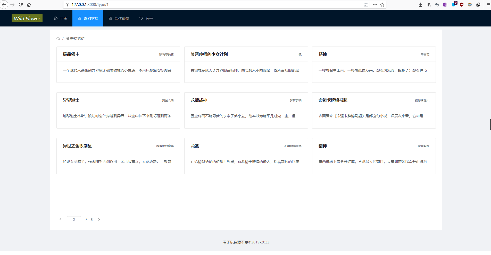

# 简介

该网站采用前后端分离 restful风格的架构，由scrapy爬取提供数据


## 前端部分

这个仓库即前端部分

react + antd design + mobx


```react
const App = () => (
  <Router>
    <Layout>
      <Header>
        <Menu mode="horizontal" theme="dark" defaultSelectedKeys={['home']} style={{ lineHeight: '64px' }}>
          <Menu.Item key="home"><Link to="/"><Icon type="home" />主页</Link></Menu.Item>
          <Menu.Item key="qihuan"><Link to="/type/1"><Icon type="appstore" />奇幻玄幻</Link></Menu.Item>
          <Menu.Item key="wuxia"><Link to="/type/2"><Icon type="appstore" />武侠仙侠</Link></Menu.Item>
          <Menu.Item key="about"><Link to="/about"><Icon type="heart" />关于</Link></Menu.Item>
        </Menu>
      </Header>
      <Content style={{ padding: '12px 200px' }}>
        <div style={{ background: '#fff', padding: 24, minHeight: 780 }}>
          <Route exact path="/" component={Home} /> //主页
          <Route path="/type/:id" component={LOT} /> //类型
          <Route path="/chapters/:id" component={LOC} /> //章节
          <Route path="/content/:id" component={ShowContent} /> //正文
          <Route path="/search" component={SC} /> //搜索
          <Route path="/about" component={About} />
        </div>
      </Content>
      <Footer style={{ textAlign: 'center' }}>
        君子以自强不息©2019-2022
      </Footer>
    </Layout>
  </Router>
);

ReactDom.render(<App />, document.getElementById('root'));

```


### 首页


### 小说类型组件




### 小说章节组件


### 小说正文组件


### 搜索组件


## 后端部分

https://github.com/abuwillbebest/back-end


前后端分离可以减少耦合，前端负责数据展示逻辑，后端负责数据获取调度逻辑。

还可以修改nginx与uwsgi间http通信为uwsgi通信，以增加效率


MySQL初始化也在此部分


```python

class Novel(models.Model):
    class Meta:
        db_table = 'novel'

    id = models.AutoField(primary_key=True)
    title = models.CharField(max_length=128, null=False)
    desc = models.TextField(null=False)
    author = models.CharField(max_length=16, null=False)
    noveltype = models.CharField(max_length=16, null=False)
    tags = models.CharField(max_length=255, null=True)


class Text(models.Model):
    class Meta:
        db_table = 'text'

    id = models.AutoField(primary_key=True)
    content = models.TextField(null=False)


class Chapter(models.Model):
    class Meta:
        db_table = 'chapter'

    id = models.AutoField(primary_key=True)
    c_title = models.CharField(max_length=256, null=False)
    words = models.IntegerField()
    ctime = models.IntegerField()
    novel = models.ForeignKey(Novel)
    content = models.ForeignKey(Text)


```


## 爬虫部分

https://github.com/abuwillbebest/scrapy-data_source


本次scrapy通用爬虫爬取纵横小说网


用一个通用爬虫按爬虫跳转顺序

`书类索引->小说详情->第一章->下一页->……->完结`

解决了小说章节顺序连贯的问题。


